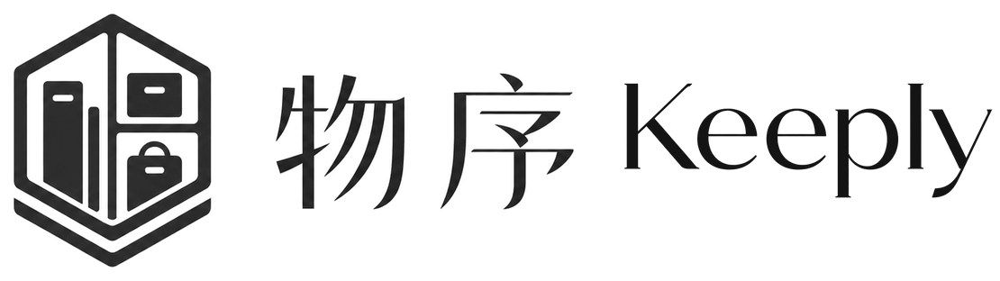

<p align="center">
  <a href="README.md">English</a>
  ·
  <a href="README.zh-CN.md"><strong>简体中文</strong></a>
</p>

<p align="center">
  <picture>
    <source media="(prefers-color-scheme: dark)" srcset="public/brand/keeply-readme-lockup-zh-dark.png">
    
  </picture>
</p>

<p align="center">
  <strong>为你拥有的每一件物品，建立安静、清晰、可自托管的档案。</strong>
  <br>
  统一管理物品、成本、保修、提醒和使用记录，在线与离线都可使用。
</p>

<p align="center">
  
  
  
  
  
</p>

---

## 项目简介

物序 Keeply 是一套本地优先的个人物品档案。所有修改会立即写入 IndexedDB，离线时仍可使用，恢复网络后再同步到你自己的 PostgreSQL。

## 核心能力

- 管理物品、费用、使用记录、保修、提醒和完整生命周期
- 多币种独立精确统计，不进行隐式汇率换算
- 支持 JSON、CSV、XLSX 和版本化 ZIP 导入导出
- 可安装 PWA，适配桌面端与移动端
- 支持中英文界面以及亮色、暗色主题
- 自托管认证与数据，提供用户隔离和安全迁移

## 技术架构

| 层级 | 技术 | 职责 |
| --- | --- | --- |
| Web | Next.js 16、React 19、TypeScript | 界面、路由、API、PWA |
| 本地数据 | Dexie、IndexedDB | 离线读取、即时写入、同步队列 |
| 身份认证 | Better Auth | 邮箱密码登录和会话 |
| 服务端数据 | PostgreSQL 17 | 用户隔离数据和同步游标 |
| 质量保障 | Vitest、Playwright、axe-core | 单元测试、浏览器流程、无障碍检查 |

```text
浏览器界面 → IndexedDB → 同步队列 ─┐
                                    ├→ Next.js API → PostgreSQL
Better Auth 会话 ───────────────────┘
```

## 快速启动

需要 Docker Engine 和 Docker Compose v2。以下方式会在本机构建 Keeply，**不需要 Docker Hub，也不会上传镜像**。

```bash
cp .env.example .env
```

将 `POSTGRES_ADMIN_PASSWORD`、`DATABASE_APP_PASSWORD` 和 `BETTER_AUTH_SECRET` 的占位值替换为三个相互独立的密钥。每个密钥可使用 `openssl rand -base64 32` 生成。

```bash
docker compose -f compose.yaml -f compose.dev.yaml up --build -d
curl --fail http://127.0.0.1:3000/api/health
```

打开 [http://localhost:3000](http://localhost:3000)。

## 本地开发

要求 Node.js 20.9+、pnpm 11 和 PostgreSQL 15+。

```bash
corepack enable
pnpm install
cp .env.example .env.local
pnpm db:migrate
pnpm dev
```

数据库和认证密钥仅供服务端使用，请勿通过 `NEXT_PUBLIC_*` 变量暴露。

## 部署

`compose.dev.yaml` 用于本地构建镜像。生产环境的 `compose.yaml` 要求 `KEEPLY_IMAGE` 和 `KEEPLY_TAG` 指向你明确发布到自有镜像仓库的版本；Keeply 不会自动推送镜像。

生产环境应使用启用 TLS 的反向代理，只在私有容器网络中运行 PostgreSQL，固定不可变镜像版本，并维护经过恢复验证的数据库备份。完整配置见 [.env.example](.env.example)。

## 质量命令

```bash
pnpm typecheck
pnpm lint
pnpm test
pnpm test:e2e
pnpm build
```

## 许可证

当前为私有产品代码。公开发布仓库前请添加计划采用的许可证。
